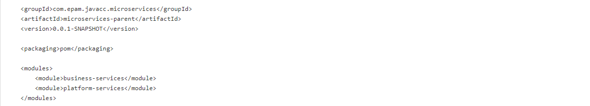
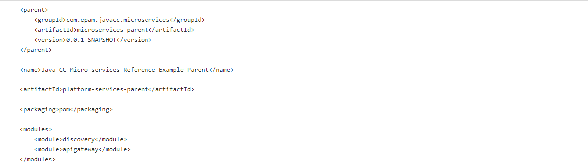
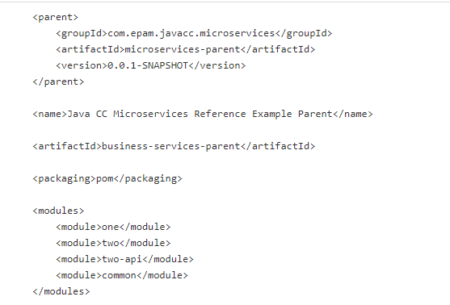
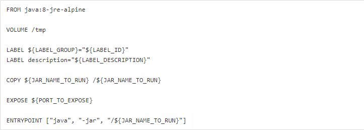
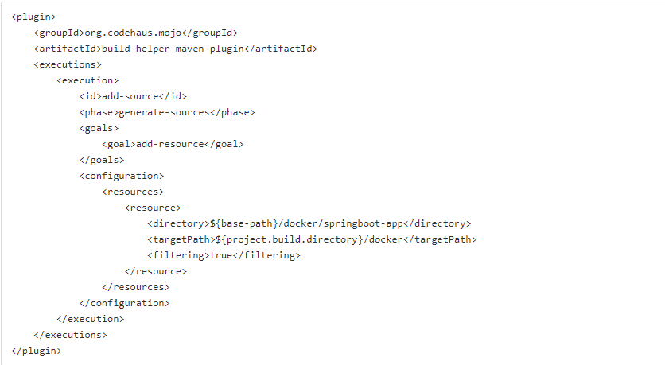
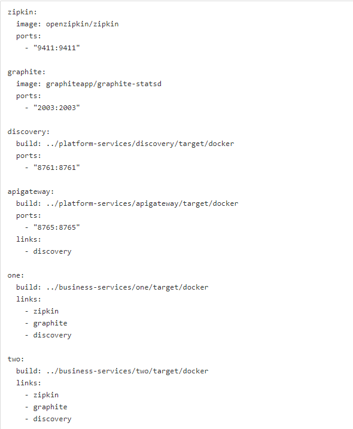

# 7. Spring cloud microservices

## Main task

1. Download Java SE Development Kit 8 according to your OS and processor’s architecture.
2. Install Java Development Kit according to JDK installation instructions (see also PATH and CLASSPATH).
3. Download Apache Maven 3.6.0 according to your OS and processor’s architecture.
4. Install Apache Maven according to installation instructions.
5. Install Docker 8.x+ .
6. Install Docker Compose 12.x+.
7. Create micro-services maven project with business-services and platform-services modules:

8. Create platform-services maven project with discovery and apigateway modules:

9. Elaborate discovery module according to guide Eureka Discovery Service. https://www.baeldung.com/spring-cloud-netflix-eureka

10. Elaborate apigateway module according to guide Zuul Proxy Service. https://www.baeldung.com/spring-rest-with-zuul-proxy

11. Create business-services maven project with common, one, two and two-api modules: 

12. Elaborate common module according to guide Archaius Configuration Service. https://www.baeldung.com/netflix-archaius-spring-cloud-integration
 
13. Elaborate one module as REST Service integrated with Servo according to guide Servo Metrics Aggregation Service (see also Eureka Discovery Service). https://www.baeldung.com/netflix-servo

14. Elaborate two module as REST Service integrated with Servo according to guide Servo Metrics Aggregation Service (see also Eureka Discovery Service). https://www.baeldung.com/netflix-servo

15. Integrate Docker file into all Spring Boot applications using template:

and maven plugin:

16. Elaborate docker compose:

17. Start services and demonstrate Discovery Service Registry, Requests via API Gateway, Zipkin Metrics and REST API requests.

## Lectures

- Microservices with SpringBoot - https://learn.epam.com/detailsPage?id=4e0a5e98-9b9e-46a1-97be-1a4d2186ca33
- Dockerizing SpringBoot microservices - https://learn.epam.com/detailsPage?id=5add66b2-7b95-4031-93d4-5e5d7736a097
- Async communication in microservices - https://learn.epam.com/detailsPage?id=d5fd03e9-a3f6-43be-a11a-cf4f22e101da
- Sync communication with Feign and Eureka - https://learn.epam.com/detailsPage?id=eb8ad9c6-27af-4018-8bb0-638edcad67c5
- Gateway with Zuul - https://www.youtube.com/watch?v=mHHHpxJuTAo
